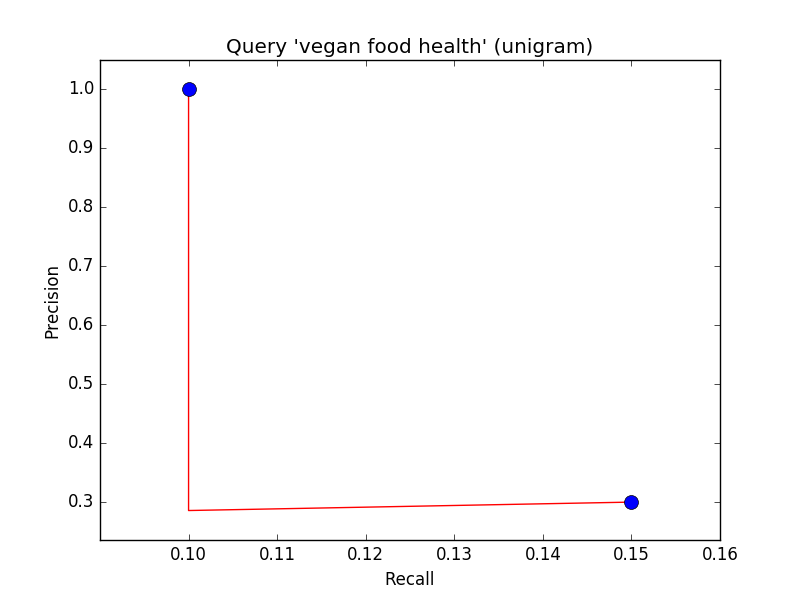

# Report lab Assignment 3

## Task 3.1: Relevance Feedback

**What happens to the two documents that you selected?**

The selected documents will eventually increase their positioning in the retrieved list.

**What are the characteristics of the other documents in the new top ten list - what are they about? Are there any new ones that were not among the top ten before?**

The new documents are supposed to be more similar to the structure of the documents we marked as relevant. However, note that we do not penalize non-relevan documents. Hence this is still not 100% accurate.

**How is the relevance feedback process affected by alpha and beta?**

The higher is the term *alpha* the more important will be the initial user query, i.e. the initially searched words. On the other hand, the higher is the term *beta* the more relevant is the Rocchio algorithm update (we do not trust much the user 'information need' guess).

**Why  is  the  search  after  feedback  slower?  Why  is  the  number  of returned documents larger?**

After the Rocchio algorithm update of the query vector _**q**_, we have that _**q**_ might in fact be larger. Thus, we have now to retrieve the union of more terms (as many as dimensions has _**q**_).

Note that, in general, the document tf-idf vectors, i.e. _**dj**_, usually contain more words than the user query. Thus, the size of the centroid of relevant documents will be larger than the initial query vector _**q**_, which leads to a search of a wider union of terms.

## Task 3.2: Designing an evaluation

As in previous assignments, we use the test query: *graduate program mathematics*

In this regard the experiment will be as following:

1. Search for the specified query
2. Select as relevant documents the ones labeled as relevant in the previous assesments.
3. Repeat 1 and 2 for a while
4. Check the precission and recall after some iterations and check if the performance improved. That is, check if both recall and precision were increased.

**Note that we consider as ground truth the relevance assesment done by myself in previous assignments.**

## Task 3.3: Speeding Up the Search Engine
For speeding up the search, I have decided to follow the approach 1). This focuses on only considering terms with idf above a certain threshold. So one question arises: How do we set the threshold? Find below some **key points**

- Since our collection contains approximately 17k elements, we have that the idf will be, at most, ln(17000) = 9.7.
- If a word appears in all documents, its idf is 0.

With this in mind, we can conclude that: _0< idf-threshold<9.7_  (approximately). I have worked with _idf-threshold=4_.

**Results**

I performed a test comparing the time needed to retrieve the result depending on the idf-threshold
value. I did two experiments.

* Experiment 1: Relevant Documents = "Zombie_Walk.f"

Threshold | Number of retrieved files | Time needed (ms) |
----------|:-------------------------:|------------------:
0         | 16030                     | [2103, 2957]     |
1         | 14485                     | [1667, 2076]     |
2         | 12375                     | [1133, 1354]     |
3         | 7473                      | [536, 654]       |
4         | 3371                      | [182, 378]       |
5         | 1286                      | [66, 121]        |
6         | 373                       | [26, 34]         |

* Experiment 2: Relevant Documents = {"Zombie_Walk.f", "Kearney_Hall.f"}

Threshold | Number of retrieved files | Time needed (ms) |
----------|:-------------------------:|------------------:
0         | 16160                     | [2787, 3249]     |
1         | 15106                     | [2380, 2657]     |
3         | 9104                      | [871, 1211]      |
4         | 6313                      | [503, 726]       |
5         | 1432                      | [72, 82]         |
6         | 373                       | [31, 37]         |

The higher is the idf-threshold, the more terms we ignore. Thus we retrieve less documents and the search is faster. At the limit, too high threshold will lead to zero retrieved documents. Looking at the results and the performance, I decided to set idf-threshold = 4.

## Task 3.4: Ranked Bi-Gram Retrieval

**How can the tf-idf score of a bi-gram be defined?**

The idea is the same as with unigrams.

- In particular, the tf component of a bigram in a document is the number of times that bigram appears in that document.
- The idf is the number of documents containing that specific bigram.
- Note that the length of the document or query is one unit less than with unigrams.

In summary, bigrams could now be seen as the tokens.

Let us now compare the performance using the BIGRAM and UNIGRAM text structure models for three different queries.

### Query 'zombie attack'

* Unigram

_Found 249 matching document(s) in 2 milliseconds_

Document                    | Score   | Relevance   |
----------------------------|:-------:|-------------:
JasonRifkind                | 5,46581 | 1           |
Zombie_Walk                 | 0,88013 | 3           |
Kearney_Hall                | 0,50976 | 0           |
Measure_Z                   | 0,45194 | 3           |
EmilyMaas                   | 0,39855 | 0           |
Spirit_Halloween            | 0,39403 | 2           |
AliciaEdelman               | 0,35427 | 0           |
Zombies_Reclaim_the_Streets | 0,29602 | 1           |
Scream                      | 0,27401 | 0           |
StevenWong                  | 0,25507 | 0           |

* Bigram

_Found 14 matching document(s) in 0 milliseconds_

Document                        | Score  | Relevance    |
--------------------------------|:------:|--------------:
Kearney_Hall                    | 0,90780| 0            |
Measure_Z                       | 0,60520| 3            |
Spirit_Halloween                | 0,42014| 2            |
Disasters                       | 0,41669| 1            |
Biological_Disasters            | 0,32588| 0            |
Scream                          | 0,29216| 0            |
Zombie_Walk                     | 0,16139| 3            |
Lame_pages                      | 0,13449| 0            |
Zombie_Attack_Response_Guide    | 0,11487| 1            |
Explore                         | 0,11297| 0            |

### Query 'money transfer'

* Unigram

_Found 1599 matching document(s) in 9 milliseconds_

Document                     | Score   | Relevance  |
-----------------------------|:-------:|------------:
MattLM                       | 1,31705 | 0                              |
Angelique_Tarazi             | 0,90114 | 0                              |
JordanJohnson                | 0,81532 | 0                              |
Transfer_Student_Services    | 0,59727 | 0                              |
NicoleBush                   | 0,47560 | 0                              |
Anthony_Swofford             | 0,33572 | 0                              |
Title_Companies              | 0,32926 | 1                              |
Transfer_Student_Association | 0,28222 | 0                              |
NinadelRosario               | 0,23137 | 0                              |
AnthonyParisi                | 0,22829 | 0                              |

* Bigram

_Found 2 matching document(s) in 0 milliseconds_

Document                        | Score   | Relevance   |
--------------------------------|:-------:|-------------:
Wells_Fargo_Controversy         | 0,32177 | 1           |
Selisa_Romero                   | 0,16574 | 0           |

### Query 'vegan food health'

* Unigram

_Found 1968 matching document(s) in 13 milliseconds_

Document                        | Score   | Relevance |
--------------------------------|:-------:|-----------:
Butterfly_Bakery                | 2,69491 | 1         |
Butterfly_Vegan                 | 2,02118 | 1         |
Indian                          | 0,56245 | 0         |
Davis_Food_Coop                 | 0,42183 | 0         |
Food_Science                    | 0,42183 | 0         |
Hometown_Chinese_Restaurant     | 0,42183 | 0         |
Hometown_Restaurant             | 0,42183 | 0         |
Thai_2k                         | 0,42183 | 0         |
The_Co-Op                       | 0,42183 | 0         |
NicoletteD                      | 0,35932 | 1         |

* Bigram

_Found 12 matching document(s) in 0 milliseconds_

Document                                | Score   | Relevance   |
----------------------------------------|:-------:|-------------:
MariahMontanez                          | 0,22848 | 3           |
BonnieStewart                           | 0,12786 | 1           |
Food                                    | 0,08472 | 1           |
AsmaMaryamMohseni                       | 0,07941 | 1           |
Vegan                                   | 0,01289 | 3           |
Vegetarian_Options                      | 0,00841 | 3           |
Whole_Foods_Market                      | 0,00771 | 3           |
Boycott%2C_Divestment%2C_And_Sanctions  | 0,00523 | 0           |
Raja%27s_Tandoor                        | 0,00396 | 2           |
Ding_How                                | 0,00361 | 2           |

### Conclusions

* We note that the set of documents retrieved is the same as if we use Unigram and Phrase Query (Assignment 1).
* We note that ...